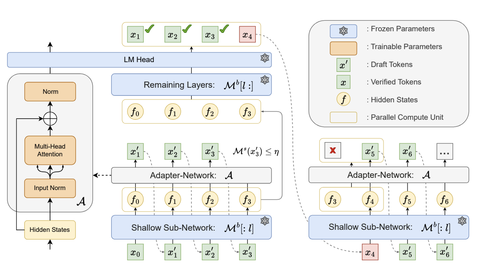

<div align="center"><h1>&nbsp;Kangaroo: Lossless Self-Speculative Decoding via Double Early Exiting</h1></div>

<p align="center">
| <a href="https://arxiv.org/abs/2404.18911"><b>Arxiv Paper</b></a> |
</p>


<p align="center">
  <a href="">
    
  </a>
  <a href="https://github.com/SafeAILab/EAGLE/pulls">
    
  </a>
</p>

<br/>

Drawing inspiration from early exiting, we propose a novel
self-speculative decoding framework Kangaroo, which uses a fixed shallow sub-network as a self-draft model, with the remaining layers serving as the larger target model. We train a lightweight and efficient adapter module on top of the sub-network to bridge the gap between the sub-network and the full model’s representation ability. The adapter network consists of only one multi-head attention and two
normalization layers. Surprisingly, we find this simple design efficient but powerful. To further reduce the inference latency of the self-draft model, we introduce an additional early exiting mechanism for generating draft tokens, aiming to avoid
unnecessary costs on more difficult tokens.

<p align="center">
  
</p>
<p align="center">
</p>


#### TODO List
- [X] infernce code & ckpts of Kangaroo.
- [] code for training Kangaroo.
- [] bsz > 1 and decoding with sampling.
- [] tree verification.

#### Inference


```python
## Vicuna-7B as an example

## Vanilla decoding
CUDA_VISIBLE_DEVICES=0 python -m evaluation.inference_baseline --model-path "/cache/CKPT/vicuna-7b-v1.3" --model-id "vicuna-7b-v1.3-vanilla-float16-temp-0.0" --bench-name "Kangaroo" --temperature 0.0 --dtype "float16"

## Kangaroo
CUDA_VISIBLE_DEVICES=0 python -m evaluation.inference_kangaroo --adapter-path "/cache/CKPT/kangaroo-vicuna-7b-v1.3" --exitlayer 2 --model-path "/cache/CKPT/vicuna-7b-v1.3" --threshold 0.6 --steps 6 --model-id "vicuna-7b-v1.3-kangaroo-thres-0.6-steps-6-float16" --bench-name "Kangaroo" --dtype "float16"
```

To get the detailed speed information, run ``python evaluation/speed.py``.

The corresponding huggingface ckpt of kangaroo can be downloaded at [Kangaroo Google Drive](https://drive.google.com/drive/folders/1_lSqhasWeIUyfCft50JtKuQ2-TWepm8p?usp=sharing).


## Acknowledgements

We acknowledge the authors of [Spec-Bench](https://github.com/hemingkx/Spec-Bench/tree/main) for the awesome benchmark.


### License

[](https://opensource.org/licenses/MIT)